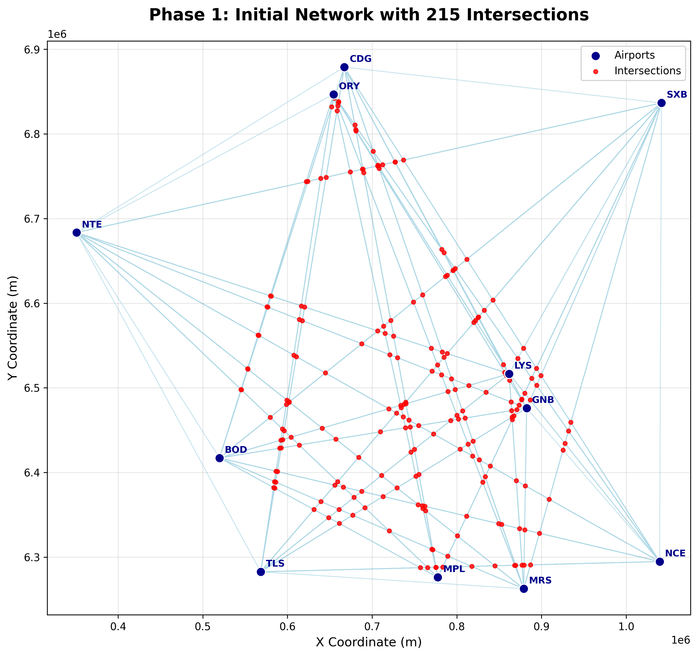
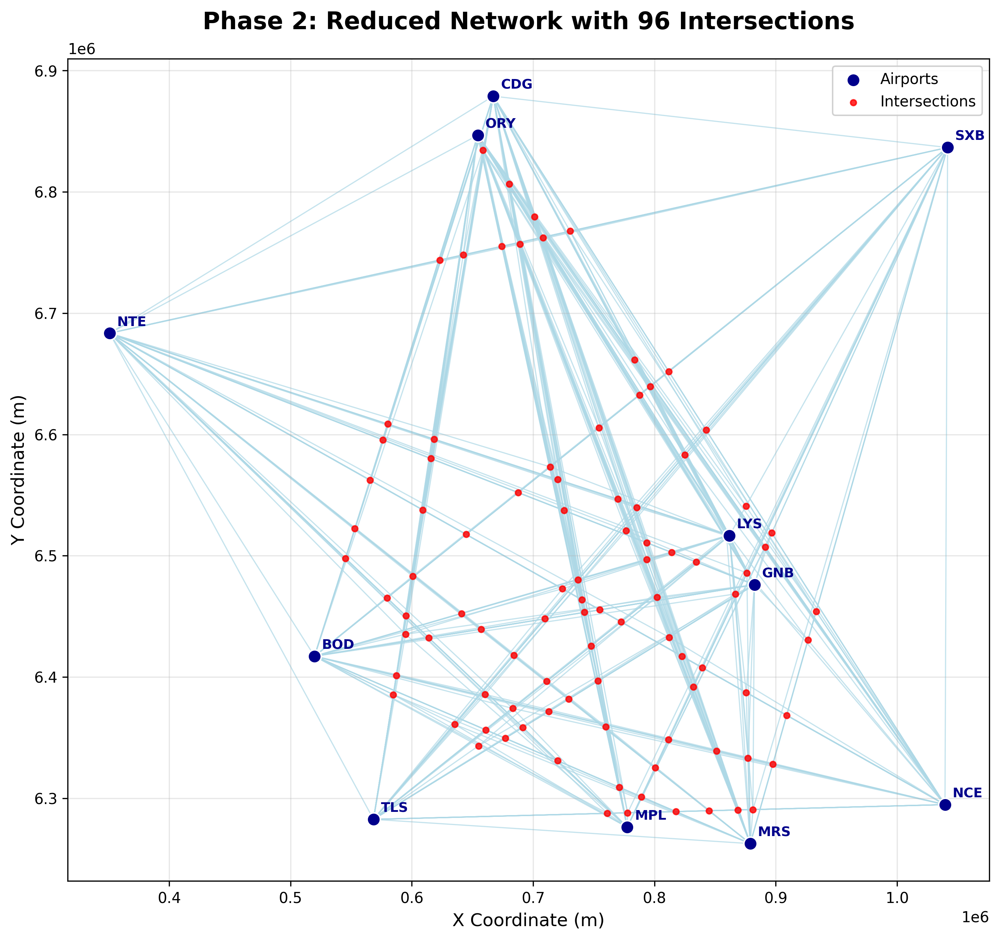
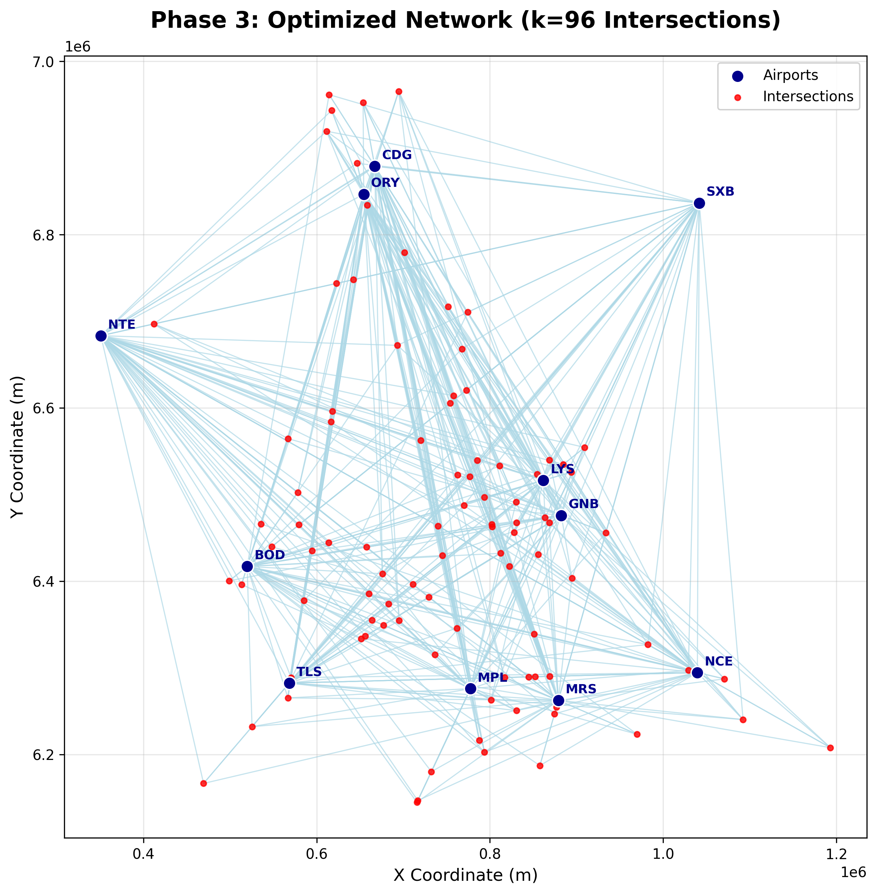
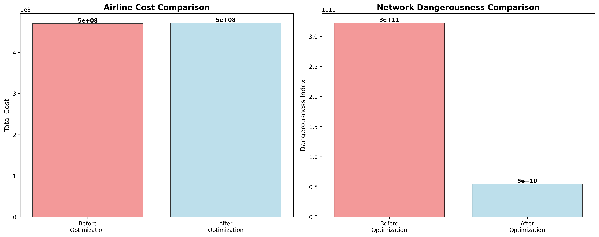

# Air Route Optimizer

A multi-objective optimization algorithm for the **French Air Route Network**, designed to prepare for the projected **doubling of global air traffic by 2037**. The system minimizes **airline operational costs** and improves **ATC safety** through intelligent route optimization.

## Problem Overview

Global air traffic will **double by 2037**, creating major challenges:

* **Higher airline costs** from inefficient routes.
* **Safety risks** due to dense traffic and complex intersections.
* **ATC workload increase** from difficult network management.
* **Environmental impact** from suboptimal flight paths.

## Approach

We address the **Crossing Waypoints Location Problem (CWLP)** using:

* **Graph-based modeling**: Airports and intersections as nodes; routes as edges.
* **Multi-objective optimization**: Balances cost vs. safety.
* **Clustering and position optimization**: Reduces complexity and improves control.

## Key Features

* **Cost Optimization**: Minimizes total flown distance.
* **Safety Optimization**: Reduces conflict points and dangerous intersections.
* **Complexity Reduction**: Fewer intersections and routes for better ATC control.
* **Scalable Design**: Handles large networks and real traffic data.

## Results Summary

### **Key Achievements**

* **83% reduction** in network dangerousness.
* **Only 0.3% cost increase** despite major safety improvements.
* **55% fewer intersections**, making the network easier to manage.
* **42% route reduction**, improving route efficiency.

### **Performance Before vs After Optimization**

| Metric                    | Before            | After            | Diff       |
| ------------------------- | ----------------- | ---------------- | ---------- |
| **Network Dangerousness** | 322,345,165,515   | 54,668,734,039   | **-83.0%** |
| **Airline Cost Index**    | 469,537,803       | 471,163,056      | **+0.3%**  |
| **Network Complexity**    | 215 intersections | 96 intersections | **-55.3%** |
| **Routes**                | 867               | 503              | **-42.0%** |

<p align="center">
  
  
  
</p>



## How It Works (Phases)

1. **Initial Network Generation**
   Builds base network from traffic data and finds all intersections.

2. **Complexity Reduction**
   Applies **K-means clustering** to reduce intersections by 55%.

3. **Position Optimization**
   Iteratively adjusts intersection positions to balance cost and safety.

---

## Quick Start

```bash
# Clone repository
git clone https://github.com/jathurchan/air-route-optimizer.git
cd air-route-optimizer

# Setup environment
python -m venv venv
source venv/bin/activate  # or venv\Scripts\activate on Windows
pip install -r requirements.txt

# Run the Jupyter Notebook
jupyter air_route_optimizer.ipynb
```
